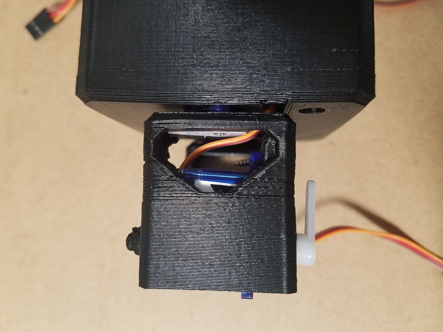
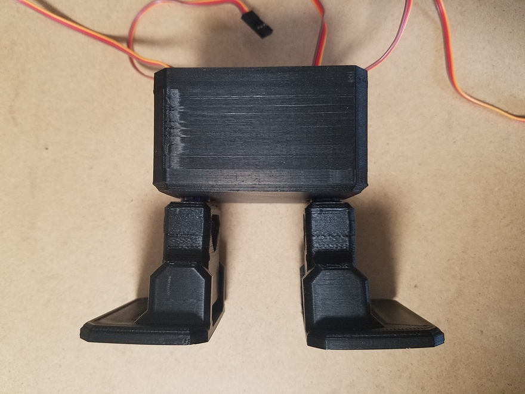

# obniz版OTTOの組み立て方

## 必要なパーツ
* [ ] 本体パーツ（頭、体、脚、足）
  * 3Dプリントデータは[こちら](https://bit.ly/2HDc4Es)
    * [obniz版3Dプリントデータ](https://goji2100.com/blog/?p=1162)も公開されています
  * 購入（セット）は[こちら](https://bit.ly/2HCfl76)
    * セットにはサーボモーター、超音波距離センサーも含まれます
* [ ] [サーボモーター（SG90）x4](https://amzn.to/2W0Nczc)
* [ ] [超音波距離センサー（HC-SR04）](https://amzn.to/2JCRc2l)
  * 飾りなので無くてもいいです
* [ ] [両端ロングピンヘッダ](https://bit.ly/2Cr0dp4)
* [ ] [obniz](https://bit.ly/2Nxce4H)

  
  


## obnizのWi-Fi接続
* 箱から出したら、マイクロUSBをobnizにつないで電源を入れます。  
  (電源を切る時はUSBを抜くだけでOKです)
* 電源が入るとスイッチの場所を教えるアニメーションがでます。  
  obnizの左上のスイッチを押すことで進み、近くのWifiリストが出てきます。  
  その中からスイッチを左右に倒すことでWiFiを選び、スイッチを押すことで選択します。
* 接続のためにWifiのパスワードを１文字ずつ入力しましょう。  
  スイッチを左右に動かし、押すことで決定します。  
  入力が終わったら「END」を選びます。
* QRコードが表示されたらWi-Fi接続完了です！


## サーボモーターの調整
最初に各サーボモーターの角度を90度に固定します。  
まずobnizとサーボモーターを接続します。  

写真のように、0ピンから順番に黄色、赤、茶色の順になるようサーボモーターを両端ロングピンヘッダに繋ぎ、obnizと接続してください。  

  
  

次に以下のソースをコピペし`calibration.js`を作成します。  
`const obnizId = "your obniz id"`にはお持ちのobnizのIDを入力してください。  

```js: calibration.js
const Obniz = require("obniz")

const obnizId = "your obniz id"

const obniz = new Obniz(obnizId)
obniz.onconnect = async function () {
    const servoMotor1 = obniz.wired("ServoMotor", {signal:0, vcc:1, gnd:2})
    const servoMotor2 = obniz.wired("ServoMotor", {signal:3, vcc:4, gnd:5})
    const servoMotor3 = obniz.wired("ServoMotor", {signal:6, vcc:7, gnd:8})
    const servoMotor4 = obniz.wired("ServoMotor", {signal:9, vcc:10, gnd:11})
    
    servoMotor1.angle(90)
    servoMotor2.angle(90)
    servoMotor3.angle(90)
    servoMotor4.angle(90)
}

```

そして以下のコマンドを実行し、obnizのパッケージインストールとサーボモーターの調整を行います。  

```bash: obnizパッケージのインストール
$ npm install -g obniz
$ node calibration.js
```


## 脚側サーボモーター取り付け
脚側のサーボモーターを体パーツに取り付けます。  
サーボモーターに付属のネジで固定します。  

  
  


## 脚パーツ取り付け
まずサーボモータに付属のサーボホーンを加工します。  
写真のように片側を中心から数えて5つ目の穴で、もう片側を中心から数えて2つ目の穴でカットします。  
カットにはニッパーを使うとやりやすいです。  
これを2つ加工します。  

  

次に写真のようにサーボモーターのケーブルを脚パーツに通したあと体パーツの穴に通してください。  

  

そして先ほど加工したサーボホーンを脚パーツにはめ込みます。  

  

最後に体パーツに固定したサーボモータと脚パーツを組み合わせ、サーボモーター付属のネジで固定します。  

  


## 足側サーボモーター取り付け
まず足側のサーボモーターに写真のような付属サーボホーンを取り付け、同じく付属ネジで固定します。  

  

そしてサーボモーターを脚パーツのくぼみに合わせはめ込みます。  

  

脚パーツにネジ穴があるので、サーボモーター付属ネジでサーボモーターと固定します。  

  


## 足パーツ取り付け
足パーツを取り付けます。  
写真のようにサーボホーン側をはめてからずらすようにすると取り付けやすいです。  

  
  


## 頭パーツの加工
OTTOは本来Arduino nano向けに設計されているため、obnizは本体に入りきりません。  
そのため頭パーツを加工してobnizを格納できるようにします。  

※ごじ氏が加工をせずともobnizを格納できる3Dプリントデータを公開されています。  
　こちらを使用する場合この工程は不要です。  

[暫定版 Otto DIY+ w/obniz 3Dプリントデータ](https://goji2100.com/blog/?p=1162)

  

後頭部側を左から5mmの位置から、横幅30mm、縦幅10mmカットします。  

  

ピンバイスやドリルで穴を開け、ニッパーで切り離します。  

  

最後にヤスリがけをして整えれば加工完了です。  

  


## サーボモーターとobnizの接続
サーボモーターの調整手順と同様にサーボモーターとobnizを接続します。  
このとき以下の並びになるよう接続してください。  
※ここでも黄色、赤、茶色の順に繋いでください

|サーボモーターの位置|ピン番号|
|---|---|
|右脚|0 1 2|
|左脚|3 4 5|
|右足|6 7 8|
|左足|9 10 11|

  

接続後、写真のようにケーブル、obnizを体パーツへ格納してください。  

  


## 頭パーツの取り付け
最後に頭パーツの取り付けです。  

まず超音波距センサーを頭パーツにはめ込みます。  
この超音波距離センサーは今回obnizへは接続しないただの飾りなので無くてもいいです。  

  
  

そして頭パーツを体パーツに組み合わせます。  

  

加工した後頭部側からobnizのUSBポートが写真のように見えていればOKです。  

  


## 完成
以上でobniz版OTTOの組み立ては完了です！  
あとは電源に繋がったUSBケーブルをさせばobnizが起動し、OTTOをobnizから操作できるようになります！  
お疲れ様でした！  

  
  
